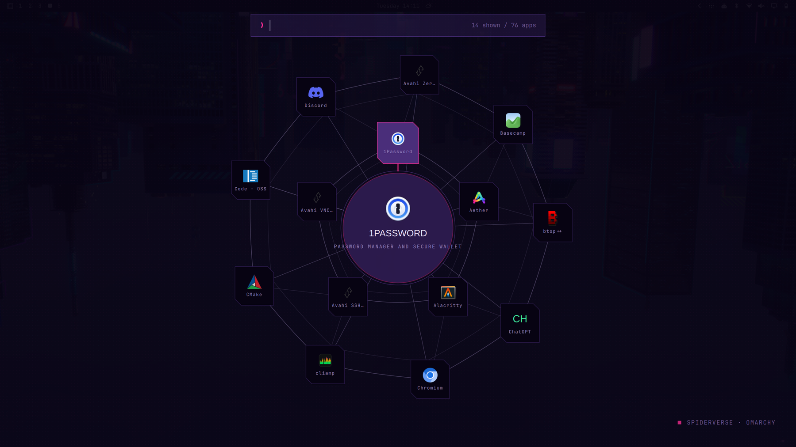

# Spiderverse for Omarchy

Across-the-Spider-Verse-inspired radial app launcher and lock screen for
[Omarchy](https://omarchy.org) (Quattro). Two independent pieces -- take
whichever one you want. Matching theme: [omarchy-spiderverse-theme](https://github.com/axelfrache/omarchy-spiderverse-theme).

## Preview




## Launcher

```bash
curl -fsSL https://raw.githubusercontent.com/axelfrache/omarchy-spiderverse/main/launcher/install.sh | bash
```

Standalone Quickshell app, no system hooks. See
[`launcher/`](launcher/) for keybindings and details.

## Lock screen

```bash
curl -fsSL https://raw.githubusercontent.com/axelfrache/omarchy-spiderverse/main/lock-plugin/install.sh | bash
```

Clones Omarchy's real lock service and overlays this theme on top. Read
[`lock-plugin/README.md`](lock-plugin/README.md) first -- it explains what
gets touched.

Prefer to read the scripts before running them? Clone the repo instead and
run `./launcher/install.sh` / `./lock-plugin/install.sh` locally -- same
scripts, no piping to bash.

## Requirements

- Omarchy Quattro (the `omarchy-shell` / Quickshell-based version)
- `qs` (Quickshell CLI), which Omarchy already ships
